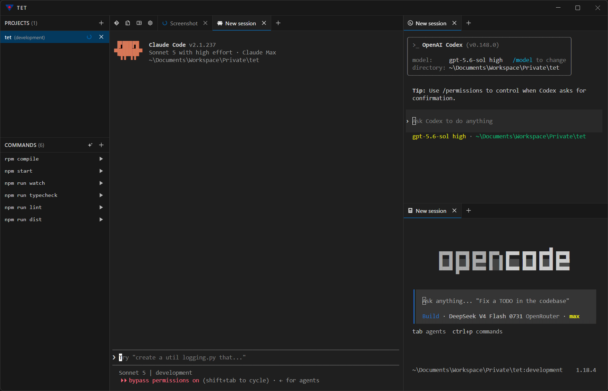

  

<em>"Welcome home, Jack."</em>

<h1 align="center">TET</h1>

  <strong>A workspace for coding agents.</strong>

  
  
  
  
  

  <a href="https://github.com/samil-kale/tet/releases/latest"><strong>Download</strong></a> &bull;
  <a href="#get-started"><strong>Build from source</strong></a> &bull;
  <a href="CLAUDE.md"><strong>Architecture notes</strong></a>

---

## TET

Agentic coding changed where developers spend their time: less in the IDE, more in a terminal
running the agent, and the git client pulled up again and again just to see what changed and
check whether the agent did what was asked. Across several projects at once, that's a loop:
switch console, switch git client, switch console, switch git client.

TET puts a project's terminals and its git state on one screen, for as many projects as are open
at once: which session needs attention, which one is still running, what changed, without a
separate git client window. It doesn't add a new way of working, it matches the one already
happening: most of it runs through a terminal now, and only a few things are still worth a click
instead of a prompt. So that's what TET builds around: several terminals per project, and a git
pane for the navigation and review that's left once the agent is done, with a diff view as a
fallback for reading code directly. A feature becomes a button only where a click beats writing
the prompt for it; everything else stays in the terminal it belongs to.

 

  

---

### Real terminals, several agents

Claude Code, opencode and Codex CLI are deeply integrated and enhanced with convenient features
like drag-and-drop for files and images.

### Multiple terminals, one glance

Split a project's terminals into several panes to see more of them at once, for a better overview.

### Smart notifications

Smart desktop notifications, plus a clear overview of what's finished and what's waiting on your
input.

### The git pane

An overview of the files the agent changed.

---

## Get started

**[Download the latest release](https://github.com/samil-kale/tet/releases/latest)** for
Windows, Linux or macOS.

## Requirements

TET needs `git` on your `PATH`, plus at least one supported agent (or just a shell) — it
checks both on startup and tells you what's missing.

