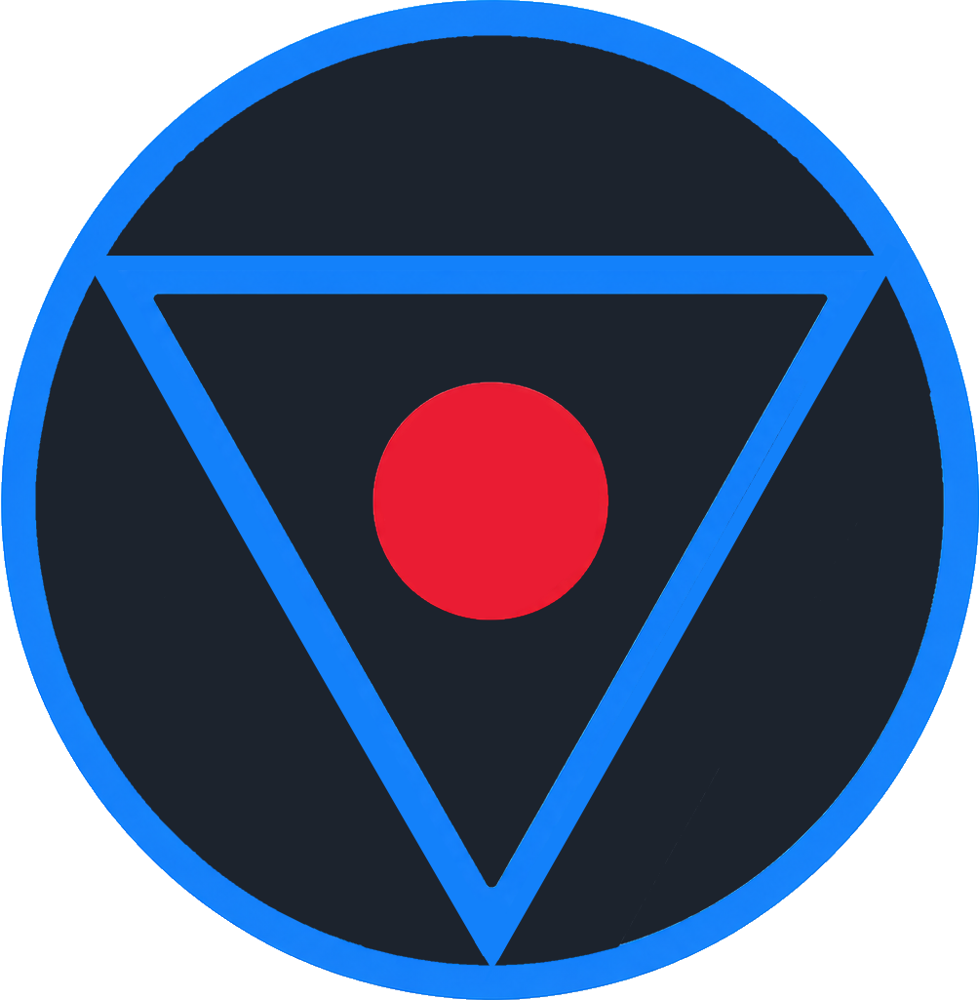

<p align="center">
  
</p>

<h1 align="center">TET</h1>

<p align="center">
  <strong>A git workspace for coding agents.<br>Several repositories, each with its own git pane and its own terminals.</strong>
</p>

<p align="center">
  <a href="https://github.com/samil-kale/tet/releases/latest"></a>
  <a href="https://github.com/samil-kale/tet/actions/workflows/build.yml"></a>
  
  
  
</p>

<p align="center">
  <a href="https://github.com/samil-kale/tet/releases/latest"><strong>Download</strong></a> &bull;
  <a href="#get-started"><strong>Build from source</strong></a> &bull;
  <a href="CLAUDE.md"><strong>Architecture notes</strong></a>
</p>

---

## The problem

Agentic coding changed where developers spend their time: less in the IDE, more in a terminal
running the agent. The git client is what's left, opened again and again just to see what
changed and check whether the agent did what was asked. With several projects running at once,
that's a loop: switch console, switch git client, switch console, switch git client.

## The solution

TET puts a project's terminals and its git state on one screen, for as many projects as are open
at once: which session needs attention, which one is still running, what changed, without a
separate git client window.

TET doesn't add a new way of working, it matches the one already happening: most of it runs
through a terminal now, and only a few things are still worth a click instead of a prompt. So
that's what TET builds around: several terminals per project, and a git pane for the navigation
and review that's left once the agent is done, with a diff view as a fallback for reading code
directly. A feature becomes a button only where a click beats writing the prompt for it;
everything else stays in the terminal it belongs to.

---

## What it does

### Real terminals, several agents

Every session is a real PTY, not a wrapped output stream — the agent's own TUI, colours and all.
TET auto-detects and drives:

- **Claude Code**, **opencode**, **Codex CLI** — session listing, resume, rename, delete
- A plain **shell**, for everything that isn't an agent
- Each agent's config is generated into TET's own storage and handed to the CLI by flag or
  env var — your own `~/.claude`, opencode config, or `~/.codex` is never read or modified

### Split view

One project's terminals split into up to four panes — five fixed layouts (single, two columns,
three columns, two columns with the right one split, 2×2), each pane with its own tab strip.
Dividers stay proportional as the window resizes; which pane a tab lives in survives a restart.

### Know what a session is doing without looking

Every tab and every project row shows one of three states, read straight from the agent's own
hooks and events — never guessed from terminal output:

- **working** — a turn is running
- **waiting on you** — a permission prompt, an elicitation, a question
- **finished out of sight** — the turn ended while you were on another tab

### The git pane

A pane that slides out next to the terminals, not a separate window:

- Branch tree — branches, remotes, tags, stashes — with checkout, discard, and per-ref actions
- Per-file diff in its own dialog, with word-level context, image diffs, and a whitespace toggle
- Fetch, pull, push, and publishing a new branch, all serialized through one action queue so a
  fetch and a discard can never race the same index lock
- Clone a new repository from GitHub or GitLab, with account-based authentication
- Nothing that needs a checkbox list, a message field, or conflict resolution — that belongs in
  an agent's terminal, where the conflict and the fix are both visible

### Saved commands

A project's own `tet.json` holds its build/start/lint commands. Running one opens a terminal
tab for exactly that process, in its own directory — no shell in between, so it behaves the same
on every platform. A wand button can ask an installed agent to fill the list in for you.

### Cross-platform, self-updating

Windows, Linux and macOS from one codebase. Windows and Linux update themselves on the next quit;
macOS links to the release page.

---

## Get started

**[Download the latest release](https://github.com/samil-kale/tet/releases/latest)** for
Windows, Linux or macOS.

TET needs `git` on your `PATH`, plus at least one supported agent (or just a shell) — it
checks both on startup and tells you what's missing.

<a id="get-started"></a>

### Build from source

**Prerequisites:** Node.js, npm

```bash
git clone https://github.com/samil-kale/tet.git
cd tet
npm install
npm start          # typecheck, compile, launch
```

Other scripts:

```bash
npm run typecheck   # tsc --noEmit
npm run lint        # eslint
npm run compile      # bundle main, preload and renderer with esbuild
npm run dist          # production build + installer via electron-builder
```

## Built with

[Electron](https://www.electronjs.org) + [React](https://react.dev) renderer,
[xterm.js](https://xtermjs.org) terminals backed by [node-pty](https://github.com/microsoft/node-pty),
[esbuild](https://esbuild.github.io) bundling, syntax highlighting via [Shiki](https://shiki.style).

## License

MIT
