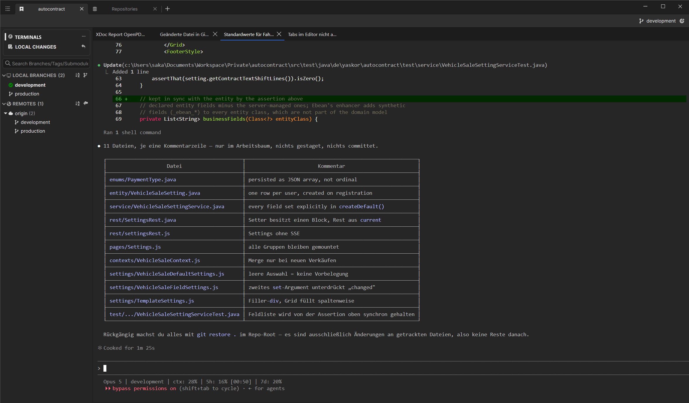
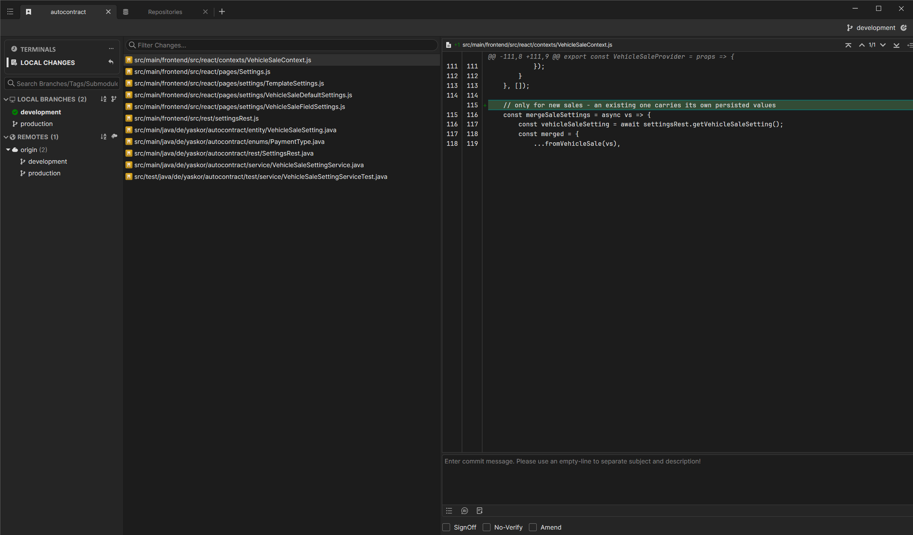

# Meeseex

## Produktidee

**Meeseex** ist ein schlanker Git-Workspace für agentisches Entwickeln.

Der Fokus liegt nicht darauf, einen vollständigen Git-Client oder eine IDE nachzubauen. Git dient hauptsächlich zur Navigation und Kontrolle des Repository-Zustands, während die eigentliche Arbeit in mehreren Agent- und Shell-Terminals stattfindet.

Kurz gesagt:

> **Git workspace for coding agents**

## Grundprinzip

Meeseex verbindet drei Dinge in einer Oberfläche:

1. Repository- und Branch-Kontext
2. Local Changes mit Diff-Ansicht
3. Mehrere Agent-/Shell-Terminals

Git bleibt bewusst reduziert. Komplexere Aktionen wie Rebase, Cherry-Pick, Merge oder Stash können direkt durch den Agenten bzw. über die Shell ausgeführt werden.


## Verbindliche UI-Referenz

Die bestehende Oberfläche aus den folgenden Screenshots ist die **visuelle Referenz für Meeseex**.

Das Programm soll sich in Aufbau, Navigation, Proportionen, Dichte und grundsätzlicher Anordnung möglichst genau daran orientieren. Die Screenshots sind dabei maßgeblicher als vereinfachte ASCII-Diagramme in diesem Dokument.

### Terminal-Ansicht



Referenzdatei: `terminals.view.png`

Wesentliche Merkmale:

- Projekt-/Repository-Tabs oben
- aktueller Branch rechts oben
- schmale linke Sidebar
- `TERMINALS` und `LOCAL CHANGES` als Hauptnavigation
- Branches und Remotes dauerhaft darunter sichtbar
- Terminal-Tabs horizontal über der Arbeitsfläche
- xterm.js nimmt praktisch die gesamte restliche Arbeitsfläche ein
- keine zusätzliche Projekt-Sidebar
- keine unnötigen Toolbars oder IDE-Elemente

### Local-Changes-Ansicht



Referenzdatei: `local-changes-view.png`

Wesentliche Merkmale:

- identische Projekt- und Sidebar-Struktur wie in der Terminal-Ansicht
- `LOCAL CHANGES` ist als Hauptansicht aktiv
- Dateiliste direkt rechts neben der Sidebar
- Diff-Ansicht rechts daneben
- Dateiliste und Diff teilen sich die verfügbare Hauptfläche
- kein zusätzlicher Editor- oder IDE-Bereich
- die Ansicht bleibt bewusst kompakt und Git-fokussiert

### UI-Grundsatz

Die vorhandene VS-Code-Plugin-Oberfläche wird nicht nur als funktionale Inspiration betrachtet, sondern als Ausgangspunkt des Desktop-Designs.

Beim Port auf Electron gilt daher:

- vorhandene Layout-Struktur möglichst beibehalten
- vorhandene Abstände und Größenverhältnisse möglichst beibehalten
- vorhandene Terminal-Tabs beibehalten
- vorhandene Sidebar-Struktur beibehalten
- vorhandene Local-Changes-Aufteilung beibehalten
- unnötige VS-Code-spezifische Elemente entfernen
- keine zusätzliche Navigation einführen, wenn sie in den Referenzansichten nicht benötigt wird
- neue Funktionen müssen sich in diese bestehende Struktur einfügen

## Navigation

### Projekte

Projekte bzw. Repositories werden als Tabs am oberen Fensterrand dargestellt.

Beispiel:

```text
[ autocontract ] [ repository-b ] [ repository-c ] [ + ]
```

Dadurch ist keine zusätzliche Project-Sidebar notwendig.

Jeder Projekt-Tab repräsentiert einen eigenen Repository-Kontext inklusive:

- aktuellem Branch
- Local Changes
- Terminal-Sessions
- Agent-Sessions

### Hauptnavigation pro Projekt

In der linken Seitenleiste befinden sich zwei Hauptansichten:

```text
TERMINALS
LOCAL CHANGES
```

Darunter bleiben Branches und Remotes dauerhaft sichtbar.

```text
TERMINALS
LOCAL CHANGES

Search branches...

LOCAL BRANCHES
  development
  production

REMOTES
  origin
    development
    production
```

Damit bleibt der Git-Kontext unabhängig von der gewählten Hauptansicht sichtbar.

## Ansicht: Terminals

Die Terminal-Ansicht ist die primäre Arbeitsfläche.

Sie enthält mehrere Terminal-/Agent-Tabs:

```text
[ Claude ] [ OpenCode ] [ Shell ] [ + ]
```

Die eigentliche Terminaldarstellung erfolgt mit **xterm.js**.

Die bereits vorhandene Terminal- und Agent-Logik aus `sbc-vsc-agents` soll möglichst weitgehend wiederverwendet werden.

Wichtige Bestandteile:

- mehrere parallele Terminal-Sessions
- Agent-Sessions
- Shell-Sessions
- Session-Resume
- Terminal-Rename/Delete
- PTY-Resize
- ANSI-/Unicode-Unterstützung
- Clipboard
- persistenter Repository-Kontext
- Claude und OpenCode als bereits vorhandene Agents
- weitere Agents über dieselbe modulare Struktur ergänzbar

## Agent-Struktur

Die grundlegende Struktur aus den bestehenden VS-Code-Plugins soll erhalten bleiben.

Agent-spezifischer Code bleibt von gemeinsam genutzter Funktionalität getrennt. Schematisch:

```text
agents/
├── claude/
├── opencode/
└── <weiterer-agent>/

shared/
├── Terminal-/PTY-Logik
├── Session-Management
├── Agent-Protokoll
├── gemeinsame Models/Types
├── UI-Bausteine
└── Theming
```

Jeder Agent erhält einen eigenen Ordner und implementiert die gemeinsame Agent-Schnittstelle bzw. das gemeinsame Protokoll.

Neue Agents sollen dadurch in derselben Art ergänzt werden können, ohne bestehende Agent-Implementierungen miteinander zu vermischen oder den Shared-Core unnötig anzupassen.

Agent-spezifisch bleiben insbesondere:

- Kommando und Startparameter
- Erkennung bzw. Verwaltung von Sessions
- Resume-Verhalten
- agent-spezifische Optionen
- agent-spezifische Statusinformationen

Im `shared`-Teil bleiben insbesondere:

- PTY- und Terminal-Anbindung
- Session-Lifecycle
- gemeinsames Messaging/Protokoll
- Repository-Kontext
- gemeinsame UI-Komponenten
- gemeinsame Types
- Theme-Integration

## Ansicht: Local Changes

Die Local-Changes-Ansicht besteht im Wesentlichen aus zwei Bereichen:

```text
┌─────────────────────────┬──────────────────────────────┐
│ Local Changes           │ Diff                         │
│                         │                              │
│ M src/foo.ts            │ - old                       │
│ M src/bar.ts            │ + new                       │
│ M src/baz.ts            │                              │
│                         │                              │
└─────────────────────────┴──────────────────────────────┘
```

Beim Klick auf eine geänderte Datei wird deren Git-Diff angezeigt.

Der Commit-Bereich ist für den Kern von Meeseex nicht notwendig. Commits können über Agent oder Shell ausgeführt werden.

## Bewusst reduzierter Git-Scope

### Bestandteil des MVP

- Repository hinzufügen
- Repository klonen
- GitHub einbinden
- GitLab einbinden
- später weitere Provider
- lokale Branches anzeigen
- Remote-Branches anzeigen
- Branch auswählen / checkout
- aktuellen Branch anzeigen
- Local Changes anzeigen
- geänderte Datei auswählen
- Git-Diff anzeigen
- Repository-Zustand automatisch aktualisieren

### Zunächst nicht notwendig

- Commit-GUI
- Commit-History
- Commit-Graph
- Interactive Rebase
- Cherry-Pick-GUI
- Stash-Manager
- Tag-Manager
- Bisect
- Submodule-GUI
- Merge-GUI
- vollständige IDE
- File-Editor
- Issue-Tracker
- vollständige Merge-Request-/Pull-Request-Oberfläche

Diese Funktionen können später ergänzt werden, wenn sich ein konkreter Bedarf ergibt.

## Technischer Stack

### Desktop

- **Electron**
- **TypeScript**
- **React**

Die bestehende modulare Struktur der VS-Code-Plugins soll beim Port auf Electron möglichst erhalten bleiben. Electron ersetzt primär den VS-Code-Extension-Host und die Webview-Kommunikation; Agent- und Shared-Code werden nicht unnötig neu strukturiert.

### Terminal

- **xterm.js**
- **node-pty**

`node-pty` übernimmt die PTY- und Prozessschicht.

Beispiel:

```text
React / xterm.js
       │
       │ IPC
       ▼
Electron Main
       │
       ▼
node-pty
       │
       ▼
Claude / OpenCode / Shell
```

Terminal-Ausgabe sollte direkt an xterm.js weitergereicht und nicht über React-State gerendert werden.

### Git

Git wird nicht selbst implementiert. Meeseex verwendet die lokal installierte Git-CLI.

Beispiele:

```text
git clone
git status
git branch
git for-each-ref
git switch
git checkout
git diff
git fetch
git pull
```

Die Electron-Main-Schicht kapselt diese Befehle und liefert strukturierte Ergebnisse an den Renderer.

Beispiel:

```text
React UI
   │
   │ IPC
   ▼
Repository Service
   │
   ▼
Git CLI
```

## Provider-Integration

GitHub, GitLab und spätere Provider sollten vom lokalen Git-System getrennt behandelt werden.

Ein Provider wird hauptsächlich benötigt für:

- Authentifizierung
- verfügbare Repositories auflisten
- Clone-URL ermitteln
- Metadaten des Remote-Repositories

Mögliche Abstraktion:

```ts
interface GitProvider {
  authenticate(): Promise<void>;
  getRepositories(): Promise<RemoteRepository[]>;
}
```

Struktur:

```text
providers/
├── github/
├── gitlab/
└── provider.ts
```

Für die eigentliche Arbeit innerhalb eines geklonten Repositories wird anschließend wieder die lokale Git-CLI verwendet.

## Architektur

```text
Electron Main
├── Terminal Service
│   ├── node-pty
│   ├── Session Lifecycle
│   ├── Resize
│   └── Process Management
│
├── Git Service
│   ├── Clone
│   ├── Branches
│   ├── Checkout
│   ├── Status
│   └── Diff
│
├── Repository Service
│   ├── Repository State
│   ├── File Watching
│   └── Refresh / Debounce
│
└── Provider Service
    ├── GitHub
    └── GitLab

Electron Renderer
├── Project Tabs
├── Sidebar
│   ├── Terminals
│   ├── Local Changes
│   ├── Branches
│   └── Remotes
│
├── Terminal View
│   ├── Agent Tabs
│   └── xterm.js
│
└── Local Changes View
    ├── Changed Files
    └── Diff Viewer

Agent Layer
├── agents/
│   ├── claude/
│   ├── opencode/
│   └── <weitere Agents>/
│
└── shared/
    ├── Terminal
    ├── Sessions
    ├── Protocol
    ├── Models / Types
    ├── UI
    └── Theming
```

## Theming

Das bestehende Theming-Konzept der VS-Code-Plugins soll erhalten bleiben.

Die UI verwendet weiterhin die bekannten **VS-Code-CSS-Variablen** statt eigener fest verdrahteter Farben.

Beispiele:

```css
color: var(--vscode-foreground);
background: var(--vscode-editor-background);
border-color: var(--vscode-panel-border);
```

Weitere typische Variablen:

```text
--vscode-foreground
--vscode-editor-background
--vscode-sideBar-background
--vscode-sideBar-foreground
--vscode-panel-background
--vscode-panel-border
--vscode-list-activeSelectionBackground
--vscode-list-activeSelectionForeground
--vscode-list-hoverBackground
--vscode-input-background
--vscode-input-foreground
--vscode-terminal-background
--vscode-terminal-foreground
```

Dadurch bleiben die vorhandenen Styles aus den VS-Code-Plugins weitgehend kompatibel.

Für Electron wird eine zentrale Theme-Schicht vorgesehen, welche die VS-Code-Farbwerte als `--vscode-*` CSS Custom Properties bereitstellt.

VS-Code-Themes sollen dadurch mit möglichst wenig Anpassung migriert werden können:

```text
VS-Code Theme
     │
     ▼
Theme Loader / Mapping
     │
     ▼
--vscode-* CSS Variablen
     │
     ▼
bestehende Meeseex-/Plugin-Styles
```

Grundregel für neue UI-Komponenten:

- keine unnötig hart codierten Farben
- vorhandene `--vscode-*` Variablen weiterverwenden
- neue Theme-Werte nur ergänzen, wenn keine passende VS-Code-Variable existiert
- Agent-spezifische UI muss dieselbe Theme-Schicht verwenden

## Repository-State

Terminal und Git-Oberfläche müssen denselben Repository-Zustand teilen.

Beispiele:

- Ein Agent führt `git switch feature/foo` aus → die Branch-Anzeige aktualisiert sich.
- Ein Agent verändert Dateien → `Local Changes` aktualisiert sich.
- Ein Branch wird über die UI gewechselt → die Terminals arbeiten anschließend im neuen Repository-Zustand.
- Ein Agent committet Änderungen → die Local-Changes-Liste leert bzw. aktualisiert sich.

Dafür sollte es pro Repository eine zentrale State-Schicht geben.

## Aktualisierung des Git-Zustands

Nicht bei jedem UI-Render Git-Kommandos starten.

Stattdessen:

1. Repository öffnen
2. initialen Git-Zustand laden
3. Filesystem überwachen
4. Änderungen kurz debouncen
5. `git status` aktualisieren
6. UI über State-Update informieren

Große Diffs sollten erst geladen werden, wenn der Benutzer eine Datei auswählt.

## Performance-Leitlinien

TypeScript selbst ist für diesen Anwendungsfall kein relevantes Performance-Risiko.

Wichtig sind vielmehr:

- Git-Prozesse nicht im Renderer ausführen
- PTYs im Electron-Main-Prozess verwalten
- Terminal-Output nicht durch React-State schicken
- IPC-Nachrichten bei sehr hohem Terminal-Output sinnvoll bündeln
- Git-Status cachen
- Filesystem-Events debouncen
- Diffs lazy laden
- große Listen bei Bedarf virtualisieren
- Hintergrundoperationen wie Clone/Fetch asynchron ausführen

## Inspiration / vorhandene Bausteine

### sbc-vsc-agents

Die vorhandene VS-Code-Erweiterung bildet bereits einen großen Teil der Terminal-Seite ab und soll als Ausgangspunkt dienen.

Insbesondere wiederverwendbar bzw. übertragbar:

- xterm.js-Terminaldarstellung
- node-pty-Anbindung
- Multi-Terminal-Konzept
- Agent-Definitionen
- Claude-Integration
- OpenCode-Integration
- Trennung der Agents in eigene Ordner
- gemeinsamer `shared`-Teil
- Sessions
- Session-Resume
- Terminal-Protokoll
- Agent-/Shell-Lifecycle
- bestehende VS-Code-CSS-Variablen für das Theming

Die Trennung zwischen Agent-Implementierungen und gemeinsamem `shared`-Code soll als grundlegendes Architekturprinzip erhalten bleiben. Weitere Agents werden nach demselben Muster ergänzt.

VS-Code-spezifische Teile werden durch Electron-IPC und eigene UI-Komponenten ersetzt. Die vorhandene Theme-Kompatibilität über `--vscode-*` CSS-Variablen bleibt erhalten.

### GitHub Desktop

GitHub Desktop ist eine wichtige Referenz für:

- Electron-/TypeScript-Struktur
- Repository-Modelle
- Git-Prozessaufrufe
- Clone
- Status
- Branches
- Checkout
- Diff

Meeseex benötigt davon nur einen kleinen Teil.

### Weitere sinnvolle Referenzen

- xterm.js
- node-pty
- Monaco Editor für eine mögliche Diff-Darstellung
- Octokit für GitHub
- GitBeaker bzw. GitLab-API-Implementierungen für GitLab

## Produktgrenze

Meeseex soll nicht zu einer weiteren IDE werden.

Die zentrale Trennung lautet:

```text
Menschen kontrollieren:
- Repository
- Branch
- Änderungen
- Diff
- Agent-Sessions

Agents erledigen:
- Codeänderungen
- Commits
- Rebase
- Merge
- Cherry-Pick
- Tests
- Build
- komplexere Git-Operationen
```

Dadurch bleibt die Oberfläche klein und auf den Agent-Workflow optimiert.

## Zielbild

Die folgenden Diagramme sind nur schematische Darstellungen. Für die tatsächliche Implementierung gelten die Screenshots `terminals.view.png` und `local-changes-view.png` als visuelle Referenz.

```text
[ project-a ] [ project-b ] [ + ]

┌──────────────────────┬─────────────────────────────────────────┐
│ TERMINALS            │ [ Claude ] [ OpenCode ] [ Shell ] [ + ]  │
│ LOCAL CHANGES        │                                         │
│                      │                                         │
│ Search branches...   │                                         │
│                      │              xterm.js                   │
│ LOCAL BRANCHES       │                                         │
│   ● development      │                                         │
│     production       │                                         │
│                      │                                         │
│ REMOTES              │                                         │
│   origin             │                                         │
│     development      │                                         │
│     production       │                                         │
└──────────────────────┴─────────────────────────────────────────┘
```

Wechsel auf `LOCAL CHANGES`:

```text
[ project-a ] [ project-b ] [ + ]

┌──────────────────────┬────────────────────────┬────────────────┐
│ TERMINALS            │ Changed Files          │ Diff           │
│ LOCAL CHANGES        │                        │                │
│                      │ M src/foo.ts           │ - old          │
│ Search branches...   │ M src/bar.ts           │ + new          │
│                      │ M src/baz.ts           │                │
│ LOCAL BRANCHES       │                        │                │
│   ● development      │                        │                │
│     production       │                        │                │
│                      │                        │                │
│ REMOTES              │                        │                │
│   origin             │                        │                │
└──────────────────────┴────────────────────────┴────────────────┘
```

## Kerngedanke

Meeseex ist kein Git-Client mit eingebautem Terminal.

**Meeseex ist ein Agent-Workspace, der gerade genug Git-Oberfläche bereitstellt, damit der Entwickler jederzeit Repository-Zustand, Branches und Änderungen kontrollieren kann.**
